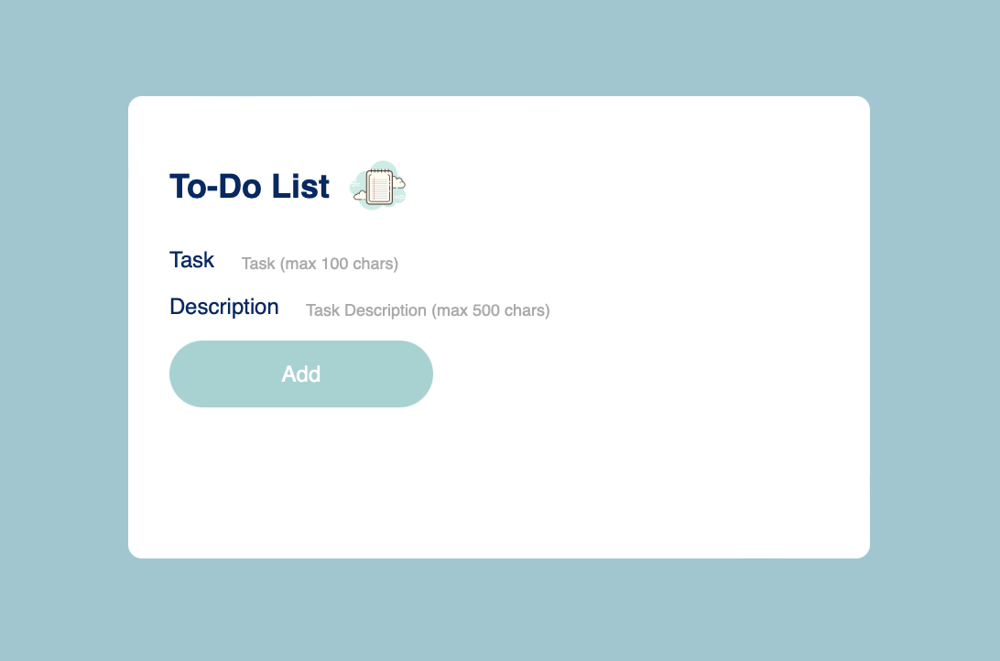
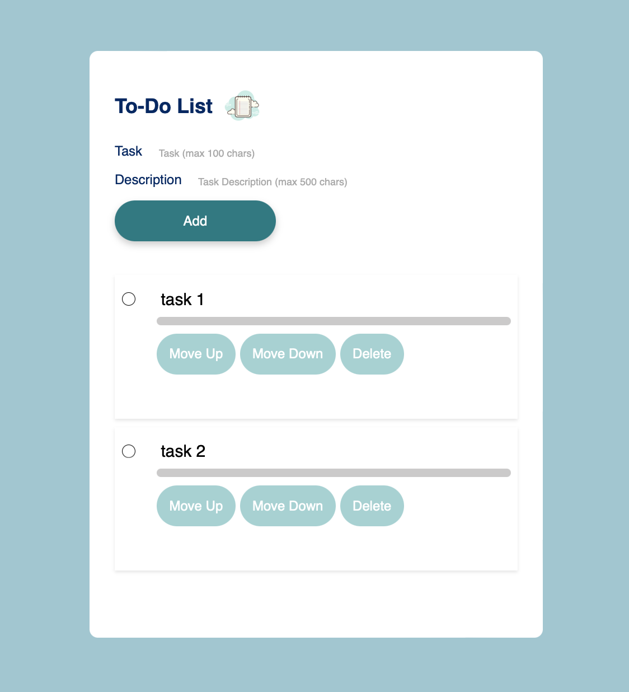
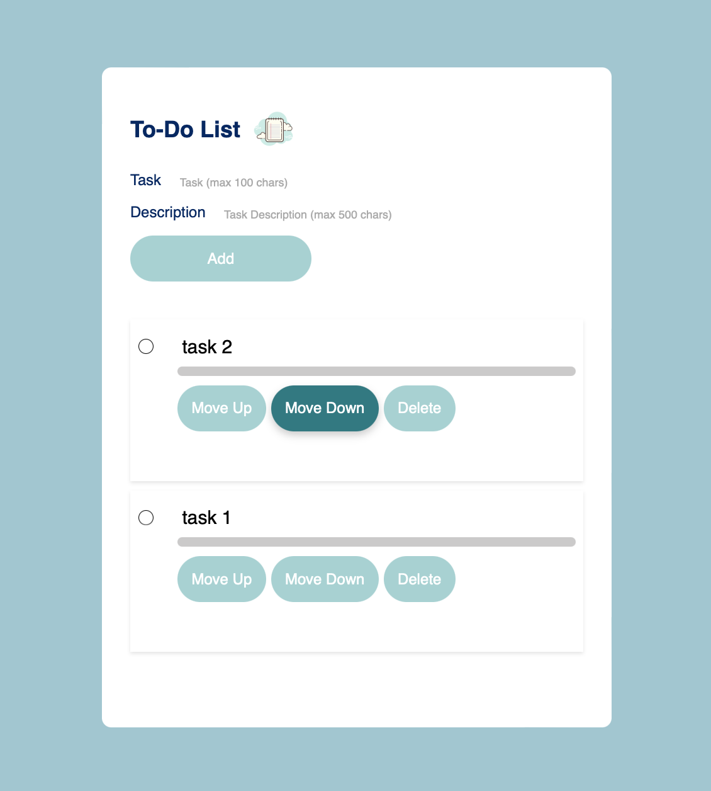
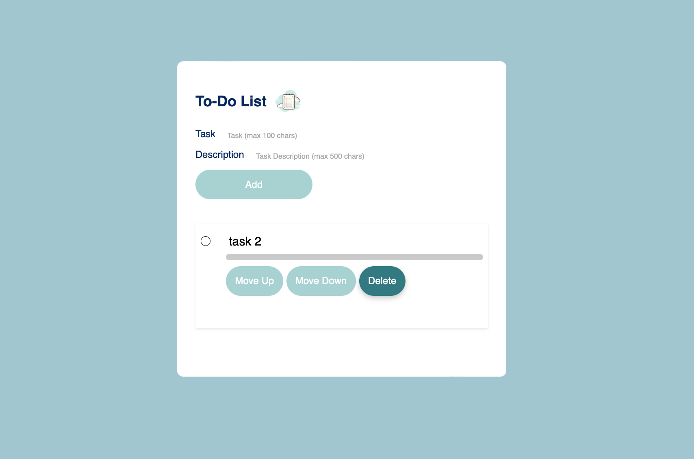

# ToDo App

Цей додаток дозволяє створювати, редагувати, видаляти та сортувати завдання.
Завдання можна позначати як виконані. Додаток має адаптивний дизайн, що дозволяє
комфортно користуватися ним на різних пристроях.

## Особливості

- Додавання завдань з назвою та описом.
- Видалення завдань.
- Переміщення завдань вгору або вниз.
- Позначення завдань як виконаних.
- Зберігання завдань в LocalStorage, щоб вони не зникали після оновлення
  сторінки.

## Технології

- HTML
- CSS (для адаптивного дизайну)
- JavaScript (для функціональності)

## Як запустити

1. Скачайте або клонуйте репозиторій:
   ```bash
   git clone
   ```

## Скріншоти

## Головна сторінка



## Додавання задач



## Зміна порядку задач



## Видалення задач


